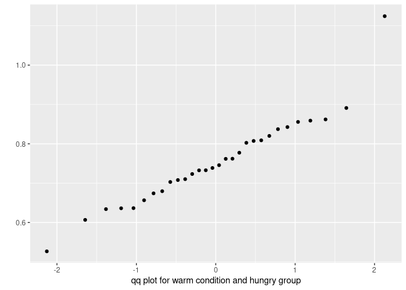
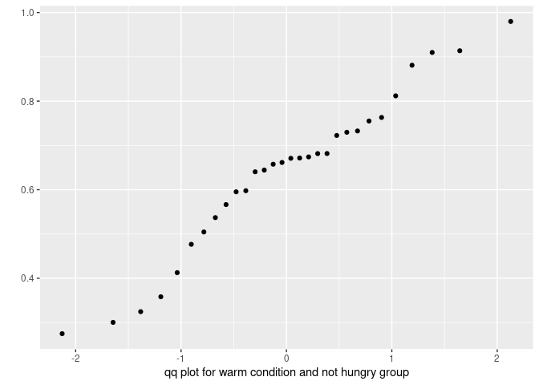
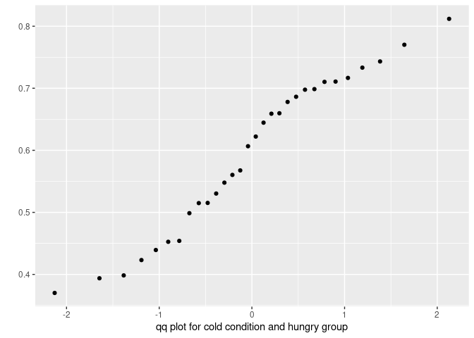
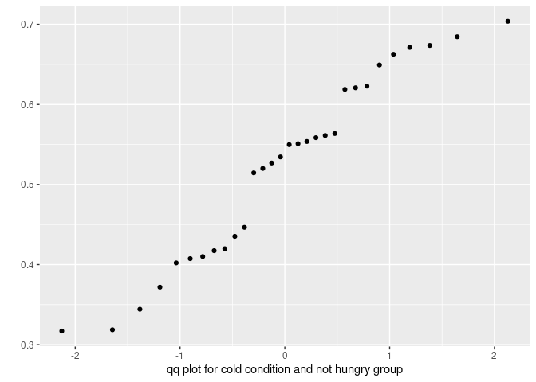

-   [Normality assumption](#normality-assumption)
-   [Homogeneity of variance
    assumption](#homogeneity-of-variance-assumption)
-   [Correlation](#correlation)
-   [Regression](#regression)
-   [T-test.](#t-test.)
-   [One-way ANOVA](#one-way-anova)
-   [repeated measures ANOVA](#repeated-measures-anova)
-   [Mixed designs (within/between
    factors)](#mixed-designs-withinbetween-factors)

Before starting data analysis, it is very important to check if
statistical assumptions are met. Yes, okay… but why? the answer is that
the so called “parametric tests” (e.g., ANOVA, t-test, regression, etc.)
require that data are within certain “parameters” in order for the
analyses to be accurate. The most important assumptions are: \*
Normality: data should be normally distributed. \* Homogeneity of
variance: variance on each group tested should be more or less equal.

Before starting, let’s create some fake data. Let’s assume that we have
reasons to believe that participants remember better images of warm food
rather that images of cold food. We might want to show them images of
cold and warm food (within-participants variable). In addition, we want
to know whether this effect changes depending on whether a participant
has already eaten or not. Therefore, we assign participants to two
groups: hungry and not-hungry. Finally, we test them through a
recognition test. Let’s simulate!

(!! Nerd Alert!! The following procedure shows how to simulate and thus
can be skipped… unless you are very interested in it (Nerd!))

``` r
# set seed
set.seed(234634)
# first, simulate recognition for hungry: the first 30 are for cold, the other 30 for warm food
recogPerfH<-c(rnorm(30, mean=0.60, sd=0.13), rnorm(30, mean=0.75, sd=0.12)) 
# now for not hungry
recogPerfnH<-c(rnorm(30, mean=0.50, sd=0.14), rnorm(30, mean=0.60, sd=0.15)) 
# merge both
recogPerf<-c(recogPerfH, recogPerfnH)
# create condition variable
condition<-rep(c("cold", "warm"), each=30, times=2)
# participant variable
participant<-c(rep(c(1:30), times=2), rep(31:60, times=2))
group<-rep(c("hungry", "not hungry"), each=60)

# bind it
dataFood<-data.frame(participant, condition, recogPerf, group)

# create also a continuous variable indicating participants' working memory performance ("wm"). 
# we are assuming that it is correlated to the recognition performance
wm<-vector()
for (n in 1:length(unique(participant))){
wm[n]<-mean(dataFood$recogPerf[dataFood$participant==dataFood$participant[n]])+rnorm(1,mean=0.10, sd=0.02)
}
# order according to participants
dataFood<-dataFood[order(dataFood$participant),]
# attach the wm variable
dataFood$wm<-rep(wm, each=2)
# check the structure of the data
str(dataFood)
```

    ## 'data.frame':    120 obs. of  5 variables:
    ##  $ participant: int  1 1 2 2 3 3 4 4 5 5 ...
    ##  $ condition  : Factor w/ 2 levels "cold","warm": 1 2 1 2 1 2 1 2 1 2 ...
    ##  $ recogPerf  : num  0.37 0.68 0.678 0.762 0.607 ...
    ##  $ group      : Factor w/ 2 levels "hungry","not hungry": 1 1 1 1 1 1 1 1 1 1 ...
    ##  $ wm         : num  0.663 0.663 0.826 0.826 0.8 ...

``` r
# Check the format of the data:
head(dataFood)
```

    ##    participant condition recogPerf  group        wm
    ## 1            1      cold 0.3701675 hungry 0.6630468
    ## 31           1      warm 0.6795923 hungry 0.6630468
    ## 2            2      cold 0.6779541 hungry 0.8260525
    ## 32           2      warm 0.7617480 hungry 0.8260525
    ## 3            3      cold 0.6066051 hungry 0.8002971
    ## 33           3      warm 0.8200754 hungry 0.8002971

The data are organized into a “long format”, in which every row
represents on condition of the variable repeated within participant. As
the only repeated variable (“condition”) has only two levels, we have
two rows for each participant.

#### Normality assumption

``` r
# check the distribution of the response variable, performance (DV)
library(ggplot2)
ggplot(dataFood, aes(recogPerf)) +
  geom_histogram(aes(y=..density..), colour="black", fill="white") +
  geom_density()+
  facet_grid(condition~group)
```


Distribution looks roughly normal. We could use a Q-Q-plot The Q-Q plot
(quantile-quantile plot) shows the correlation between the observed data
and the expected values, namely the values if data were normally
distributed. If observed data are normally distributed, the q-q plot
looks as a straight diagonal line. Deviations from the diagonal shows
deviation from normality.

``` r
qplot(sample = dataFood$recogPerf[dataFood$condition=="warm" & dataFood$group=="hungry"], stat="qq", 
      xlab="qq plot for warm condition and hungry group")
```



``` r
qplot(sample = dataFood$recogPerf[dataFood$condition=="warm" & dataFood$group=="not hungry"], stat="qq",
            xlab="qq plot for warm condition and not hungry group")
```



``` r
qplot(sample = dataFood$recogPerf[dataFood$condition=="cold" & dataFood$group=="hungry"], stat="qq",
                  xlab="qq plot for cold condition and hungry group")
```



``` r
qplot(sample = dataFood$recogPerf[dataFood$condition=="cold" & dataFood$group=="not hungry"], stat="qq", 
                  xlab="qq plot for cold condition and not hungry group")
```



They look close to normality, apart from some outliers in the condition
“cold” and “hungry”. We have to check it statistically.

In order to test whether the distribution deviates from a normal
distribution, we can use the Shapiro-Wilk test. This test compares the
observed vales are significantly different from normally distributed
values. It the test is non-significant (p\>.05), the distribution of
data is not different from a normal distribution.

``` r
shapiro.test(dataFood$recogPerf[dataFood$condition=="warm" & dataFood$group=="hungry"])
```

    ## 
    ##  Shapiro-Wilk normality test
    ## 
    ## data:  dataFood$recogPerf[dataFood$condition == "warm" & dataFood$group ==     "hungry"]
    ## W = 0.93816, p-value = 0.08114

``` r
shapiro.test(dataFood$recogPerf[dataFood$condition=="cold" & dataFood$group=="hungry"])
```

    ## 
    ##  Shapiro-Wilk normality test
    ## 
    ## data:  dataFood$recogPerf[dataFood$condition == "cold" & dataFood$group ==     "hungry"]
    ## W = 0.94964, p-value = 0.1653

``` r
shapiro.test(dataFood$recogPerf[dataFood$condition=="warm" & dataFood$group=="not hungry"])
```

    ## 
    ##  Shapiro-Wilk normality test
    ## 
    ## data:  dataFood$recogPerf[dataFood$condition == "warm" & dataFood$group ==     "not hungry"]
    ## W = 0.96162, p-value = 0.3405

``` r
shapiro.test(dataFood$recogPerf[dataFood$condition=="cold" & dataFood$group=="not hungry"])
```

    ## 
    ##  Shapiro-Wilk normality test
    ## 
    ## data:  dataFood$recogPerf[dataFood$condition == "cold" & dataFood$group ==     "not hungry"]
    ## W = 0.94587, p-value = 0.131

As we can see, the four tests indicate that data does not deviate from
normality. In case data are not normally distributed, we can use a
transformation (square, log, inverse transformation), use a non-
parametric test (e.g., Spearman correlation, Mann-Whitney for comparing
two means, Kruskal-Wallis for comparing multiple means), or we can use a
different distribution (binomial, multinomial, etc.).

#### Homogeneity of variance assumption

In addition to being normally distributed, parametric tests require that
the variances of different levels of one variable should be more or less
equal. In other words, the variances should be “homogeneous”. In order
to check for homogeneity fo variance, we can use the Levene test.

``` r
library(car)
# We can check first if the variance differ across food condition
leveneTest(dataFood$recogPerf, dataFood$condition)
```

    ## Levene's Test for Homogeneity of Variance (center = median)
    ##        Df F value Pr(>F)
    ## group   1  0.5047 0.4788
    ##       118

``` r
# then across hunger group
leveneTest(dataFood$recogPerf, dataFood$group)
```

    ## Levene's Test for Homogeneity of Variance (center = median)
    ##        Df F value Pr(>F)
    ## group   1  1.4927 0.2242
    ##       118

Variance seems to be homogeneous across condition and group. Let’s run
our parametric tests!

#### Correlation

We can start our analysis by checking whether participants’ working
memory correlates with recognition performance.

In order to do this, we need to work on a “wide-dataset”, where every
row represents a participant. We can use the “reshape” function from the
“reshape2” package.

``` r
library(reshape2)
# create a wide dataset by aggregating performance on the participant level.
# in order to do that, we can use the reshape function. 
# We need to specify the grouping variables ("idvar"), i.e. the variables that vary between participants. Those are participants' id, group, and wm. The condition that varies within participant ("timevar") is "condition". 
dataFoodBetw<-reshape(dataFood, idvar = c("participant", "group", "wm"), timevar = "condition", direction = "wide")

# let's have a look at this dataset.
head(dataFoodBetw)
```

    ##   participant  group        wm recogPerf.cold recogPerf.warm
    ## 1           1 hungry 0.6630468      0.3701675      0.6795923
    ## 2           2 hungry 0.8260525      0.6779541      0.7617480
    ## 3           3 hungry 0.8002971      0.6066051      0.8200754
    ## 4           4 hungry 0.6848700      0.4540464      0.7102183
    ## 5           5 hungry 0.6968984      0.4525917      0.8072747
    ## 6           6 hungry 0.7940126      0.7107697      0.7325580

``` r
# as you can see, we have two columns indicating "recogPerf.warm" for warm condition, and "recogPerf.cold" for cold condition. 

# We want to aggregate it by averaging within participant, to have one variable indicating the recognition performance at the participant level. 
# we can use the useful "rowMeans" function
dataFoodBetw$recogPerfAvg<-rowMeans(dataFoodBetw[c("recogPerf.warm", "recogPerf.cold")])

# check if wm is normally distributed
shapiro.test(dataFoodBetw$wm)
```

    ## 
    ##  Shapiro-Wilk normality test
    ## 
    ## data:  dataFoodBetw$wm
    ## W = 0.96993, p-value = 0.1447

``` r
# do the same for the aggregated recognition performance
shapiro.test(dataFoodBetw$recogPerfAvg)
```

    ## 
    ##  Shapiro-Wilk normality test
    ## 
    ## data:  dataFoodBetw$recogPerfAvg
    ## W = 0.97621, p-value = 0.2898

``` r
# they are both normally distributed. Let's do the correlation. 
cor.test(dataFoodBetw$recogPerfAvg, dataFoodBetw$wm)
```

    ## 
    ##  Pearson's product-moment correlation
    ## 
    ## data:  dataFoodBetw$recogPerfAvg and dataFoodBetw$wm
    ## t = 2.2897, df = 58, p-value = 0.02569
    ## alternative hypothesis: true correlation is not equal to 0
    ## 95 percent confidence interval:
    ##  0.03667974 0.50493156
    ## sample estimates:
    ##       cor 
    ## 0.2879228

There is a significant correlation between participants’ working memory
and their recognition performance: Person’s r = 0.29, p \< .026.

#### Regression

With regression we also explore relationships between variables. Unlike
correlation, regression assumes that there are a response variable (or
Dependent Variable, or outcome) and one or several predictors (or
independent variables). It also allows to make prediction, thanks to the
coefficients that it returns. Let’s consider our working memory -
recognition relationship as a regression.

``` r
# R uses the "lm" (Linear Model) function to compute regression
regres<-lm(recogPerfAvg~wm, data=dataFoodBetw)
# on the left side of the "~" there is the dependent variable, on the right the predictor(s)

# let's have a look at the output
summary(regres)
```

    ## 
    ## Call:
    ## lm(formula = recogPerfAvg ~ wm, data = dataFoodBetw)
    ## 
    ## Residuals:
    ##      Min       1Q   Median       3Q      Max 
    ## -0.26837 -0.05103  0.01087  0.07627  0.23227 
    ## 
    ## Coefficients:
    ##             Estimate Std. Error t value Pr(>|t|)   
    ## (Intercept)   0.3690     0.1134   3.254   0.0019 **
    ## wm            0.3332     0.1455   2.290   0.0257 * 
    ## ---
    ## Signif. codes:  0 '***' 0.001 '**' 0.01 '*' 0.05 '.' 0.1 ' ' 1
    ## 
    ## Residual standard error: 0.09802 on 58 degrees of freedom
    ## Multiple R-squared:  0.0829, Adjusted R-squared:  0.06709 
    ## F-statistic: 5.243 on 1 and 58 DF,  p-value: 0.02569

The intercept is not informative in this case: it just tells us that
when wm is 0, recognition performance is 0.369, and that this value is
significantly different from 0. The estimate for “wm” tells us that
after one unit change in our predictor (working memory), the response
(recognition memory in %) increases by 0.33. This effect is significant.

#### T-test.

We use t-tests to compare differences between two groups or conditions.
In our foodData we have two groups and two conditions: the hungry - not
hungry groups vary between participants, while the warm-cold conditions
vary within-participants. Let’s test if they differ! We can start from
the between-participants variable.

``` r
t.test(recogPerfAvg~group, data = dataFoodBetw)
```

    ## 
    ##  Welch Two Sample t-test
    ## 
    ## data:  recogPerfAvg by group
    ## t = 4.0861, df = 57.953, p-value = 0.0001366
    ## alternative hypothesis: true difference in means is not equal to 0
    ## 95 percent confidence interval:
    ##  0.04854198 0.14177779
    ## sample estimates:
    ##     mean in group hungry mean in group not hungry 
    ##                0.6745251                0.5793652

There is a significant difference between the groups, so that hungry
group better recognised the images.

The t-test, like the ANOVA, can be considered as a special case of
regression, in which the predictor (IV) is categorical. R automatically
[dummy-codes](https://stats.idre.ucla.edu/other/mult-pkg/faq/general/faqwhat-is-dummy-coding/)
the two group as “0” and “1” and returns the difference between the two.
Therefore, we could run a t-test by using the lm function as we have
already done for regression

``` r
ttestasreg<-lm(recogPerfAvg~group, data = dataFoodBetw)

summary(ttestasreg)
```

    ## 
    ## Call:
    ## lm(formula = recogPerfAvg ~ group, data = dataFoodBetw)
    ## 
    ## Residuals:
    ##       Min        1Q    Median        3Q       Max 
    ## -0.155386 -0.064655 -0.009141  0.054885  0.259226 
    ## 
    ## Coefficients:
    ##                 Estimate Std. Error t value Pr(>|t|)    
    ## (Intercept)      0.67453    0.01647  40.961  < 2e-16 ***
    ## groupnot hungry -0.09516    0.02329  -4.086 0.000136 ***
    ## ---
    ## Signif. codes:  0 '***' 0.001 '**' 0.01 '*' 0.05 '.' 0.1 ' ' 1
    ## 
    ## Residual standard error: 0.0902 on 58 degrees of freedom
    ## Multiple R-squared:  0.2235, Adjusted R-squared:  0.2101 
    ## F-statistic:  16.7 on 1 and 58 DF,  p-value: 0.0001365

``` r
# the t-value and p-value are the same as the t-test that we did before. 
```

The only difference with the test that we run before is that the the
sign of the t-value in the lm was negative. This occurs because the
values that are shown refer to the difference between the “not hungry”
condition and the “hungry condition”, the latter being the reference
level (R automatically assigns reference level according to alphabetical
order).

Now we can compare the within-participants variable: condition (warm vs
cold) In this case we have to use a paired sample t-test. We can use the
t-test function and specify that the data are paired.

``` r
# subset the variable to extract the data 

t.test(dataFoodBetw$recogPerf.warm, dataFoodBetw$recogPerf.cold, paired = TRUE)
```

    ## 
    ##  Paired t-test
    ## 
    ## data:  dataFoodBetw$recogPerf.warm and dataFoodBetw$recogPerf.cold
    ## t = 5.2523, df = 59, p-value = 2.159e-06
    ## alternative hypothesis: true difference in means is not equal to 0
    ## 95 percent confidence interval:
    ##  0.08604487 0.19195630
    ## sample estimates:
    ## mean of the differences 
    ##               0.1390006

``` r
# this t-test is considering that each case is "paired" with the other, meaning that it is coming from the same participant. 

# we could also run it in our long dataset
t.test(recogPerf~condition, data = dataFood, paired =T)
```

    ## 
    ##  Paired t-test
    ## 
    ## data:  recogPerf by condition
    ## t = -5.2523, df = 59, p-value = 2.159e-06
    ## alternative hypothesis: true difference in means is not equal to 0
    ## 95 percent confidence interval:
    ##  -0.19195630 -0.08604487
    ## sample estimates:
    ## mean of the differences 
    ##              -0.1390006

``` r
# in order to understand the direction of the difference, let's get the means of the two conditions
by(dataFood$recogPerf, dataFood$condition, FUN = mean)
```

    ## dataFood$condition: cold
    ## [1] 0.5574449
    ## ------------------------------------------------------------ 
    ## dataFood$condition: warm
    ## [1] 0.6964455

Warm food is remembered better than cold food. We could also consider
the paired-sample t-test as a regression, but in this case would be a
bit more difficult. In fact, in this case we have to take into account
the dependency in the data, and this is usually done by adding random
effects to the normal regression. But we can look into it later on.

#### One-way ANOVA

now that we know how to compare two means, we can consider cases in
which we have more than two. This is usually done with an ANOVA.

(!! Nerd Alert !!) We need to create a third group in our data. The
following section is not important and can be skipped, unless you really
want to be a Nerd.

``` r
# we can create a third group of "superhungry" people that are just starving
recogPerfSH<-c(rnorm(30, mean=0.40, sd=0.13), rnorm(30, mean=0.50, sd=0.12)) 

# create condition variable
condition<-rep(c("cold", "warm"), each=30)
# participant variable
participant<-rep((61:90), times=2)
# group variable
group<-rep("superhungry", times=30)

# bind it
dataFoodSH<-data.frame(participant, condition, "recogPerf" = recogPerfSH, group)

# working memory
wm<-vector()
for (n in 1:length(unique(participant))){
  wm[n]<-mean(dataFoodSH$recogPerf[dataFoodSH$participant==dataFoodSH$participant[n]])+rnorm(1,mean=0.10, sd=0.02)
}

# order according to participants
dataFoodSH<-dataFoodSH[order(dataFoodSH$participant),]
# attach the wm variable
dataFoodSH$wm<-rep(wm, each=2)

# attach to the previous dataframe
dataFood<-rbind(dataFood, dataFoodSH)

# re-create the dataframe aggregated
dataFoodBetw<-reshape(dataFood, idvar = c("participant", "group", "wm"), timevar = "condition", direction = "wide")

dataFoodBetw$recogPerfAvg<-rowMeans(dataFoodBetw[c("recogPerf.warm", "recogPerf.cold")])
```

Okay, now let’s compare the three groups (hungry, not hungry,
superhungry) in our wide format dataset (dataFoodBetw). we can use the
“aov” function

``` r
# let's run a leven test first
leveneTest(dataFoodBetw$recogPerfAvg, dataFoodBetw$group, center = mean)
```

    ## Levene's Test for Homogeneity of Variance (center = mean)
    ##       Df F value Pr(>F)
    ## group  2  0.0545  0.947
    ##       87

``` r
# since is it is non-significant, the variances of the two groups are similar
anova1<-aov(recogPerfAvg~group, data=dataFoodBetw)

# let's see the results
summary(anova1)
```

    ##             Df Sum Sq Mean Sq F value Pr(>F)    
    ## group        2 0.9684  0.4842   58.91 <2e-16 ***
    ## Residuals   87 0.7151  0.0082                   
    ## ---
    ## Signif. codes:  0 '***' 0.001 '**' 0.01 '*' 0.05 '.' 0.1 ' ' 1

``` r
# the "summary" function returns the "omnibus" test, testing whether the recognition performance varies as a function of the hunger group. If we want to have an idea on the differences between the different conditions, we can run the ANOVA as a regression, by using the "lm" function. 

anova2<-lm(recogPerfAvg~group, data=dataFoodBetw)
summary(anova2)
```

    ## 
    ## Call:
    ## lm(formula = recogPerfAvg ~ group, data = dataFoodBetw)
    ## 
    ## Residuals:
    ##       Min        1Q    Median        3Q       Max 
    ## -0.157293 -0.064689 -0.009141  0.054474  0.259226 
    ## 
    ## Coefficients:
    ##                  Estimate Std. Error t value Pr(>|t|)    
    ## (Intercept)       0.67453    0.01655  40.750  < 2e-16 ***
    ## groupnot hungry  -0.09516    0.02341  -4.065 0.000105 ***
    ## groupsuperhungry -0.25162    0.02341 -10.749  < 2e-16 ***
    ## ---
    ## Signif. codes:  0 '***' 0.001 '**' 0.01 '*' 0.05 '.' 0.1 ' ' 1
    ## 
    ## Residual standard error: 0.09066 on 87 degrees of freedom
    ## Multiple R-squared:  0.5752, Adjusted R-squared:  0.5655 
    ## F-statistic: 58.91 on 2 and 87 DF,  p-value: < 2.2e-16

The output of the ANOVA as regression analysis shows three coefficients.
The intercept represents the mean recognition performance for the
baseline condition (group “hungry”, coded as baselin because it is the
first in alphabetical order). The “groupnot hungry” represents the
difference between recognition performance of the group “not hungry” and
recognition performance of the group “hungry” (baseline). Participants
who are hungry performs a bit worse than participants that are hungry,
and the difference in performance is significant. finally, the
coefficient “groupsuperhungry” represents the difference in recognition
performance between the superhungry group and the hungry group. The
superhungry performed significantly worse than the hungry ones… probably
at some point the hunger becomes really distracting :)

But what about the difference between the superhungry and not hungry
groups? If we are interested in it, we can change the reference category

``` r
# let's make the "superhungry" group the reference level. 
dataFoodBetw$group<-relevel(dataFoodBetw$group, ref = "superhungry")

# run the anova aagain
anova3<-lm(recogPerfAvg~group, data=dataFoodBetw)

summary(anova3)
```

    ## 
    ## Call:
    ## lm(formula = recogPerfAvg ~ group, data = dataFoodBetw)
    ## 
    ## Residuals:
    ##       Min        1Q    Median        3Q       Max 
    ## -0.157293 -0.064689 -0.009141  0.054474  0.259226 
    ## 
    ## Coefficients:
    ##                 Estimate Std. Error t value Pr(>|t|)    
    ## (Intercept)      0.42291    0.01655  25.549  < 2e-16 ***
    ## grouphungry      0.25162    0.02341  10.749  < 2e-16 ***
    ## groupnot hungry  0.15646    0.02341   6.683 2.13e-09 ***
    ## ---
    ## Signif. codes:  0 '***' 0.001 '**' 0.01 '*' 0.05 '.' 0.1 ' ' 1
    ## 
    ## Residual standard error: 0.09066 on 87 degrees of freedom
    ## Multiple R-squared:  0.5752, Adjusted R-squared:  0.5655 
    ## F-statistic: 58.91 on 2 and 87 DF,  p-value: < 2.2e-16

The superhungry group performed worse than the not hungry group. You
could also use different contrasts (repeated, helmert, etc.) or make
your own contrasts. See
[here](http://letmegooglethat.com/?q=Anova+contrasts+in+R) how

#### repeated measures ANOVA

We have seen how to run an ANOVA when our dependent variable varies
between participants. But what about within-participants variables?

First, we need to create a third condition. Let’s imagine that we are
also showing images of frozen food.

(!! Nerd Alert !!) You know what I mean.

``` r
recogPerfH<-rnorm(30, mean=0.50, sd=0.13)
# now for not hungry
recogPerfnH<-rnorm(30, mean=0.40, sd=0.14)

recogPerfSH<-rnorm(30, mean=0.30, sd=0.13)

# merge both
recogPerf<-c(recogPerfH, recogPerfnH,recogPerfSH)
# create condition variable
condition<-rep("frozen", times = 90)
# participant variable
participant<-1:90
group<-rep(c("hungry", "not hungry", "superhungry"), each=30)

# bind it
dataFood3<-data.frame(participant, condition, recogPerf, group)

# create working memory
for (n in 1:length(unique(participant))){
  wm[n]<-mean(dataFood3$recogPerf[dataFood3$participant==dataFood3$participant[n]])+rnorm(1,mean=0.10, sd=0.02)
}
# order according to participants
dataFood3<-dataFood3[order(dataFood3$participant),]
# attach the wm variable
dataFood3$wm<-wm


# finally, attach the so-created data to the dataframe
dataFood<-rbind(dataFood, dataFood3)

# order it according to participants
dataFood<-dataFood[order(dataFood$participant),]

# lets have a look at the data
head(dataFood)
```

    ##     participant condition recogPerf  group        wm
    ## 1             1      cold 0.3701675 hungry 0.6630468
    ## 31            1      warm 0.6795923 hungry 0.6630468
    ## 123           1    frozen 0.3512959 hungry 0.4174005
    ## 2             2      cold 0.6779541 hungry 0.8260525
    ## 32            2      warm 0.7617480 hungry 0.8260525
    ## 212           2    frozen 0.5485068 hungry 0.6709165

You can see that we now have three different measures for each
participant, corresponding to the three food conditions: cold, warm, and
frozen.

Now we want to check whether the recognition performance varies as a
function of these three food conditions, that are repeated withing
participants. In order to do that, we can use the “ezAnova” function,
from the package “ez”

``` r
library(ez)
# convert participant variable as factor
dataFood$participant<-as.factor(dataFood$participant)
ezModel<-ezANOVA(data = dataFood, # dataframe
                 dv = .(recogPerf), # dependent variable. This functions requires to place the name of each variable within .() 
                 wid = .(participant), # variable that identifies participants )
                 within = .(condition), # independent variable
                 detailed = T
                 )

# let's call the model
ezModel
```

    ## $ANOVA
    ##        Effect DFn DFd       SSn      SSd          F            p p<.05
    ## 1 (Intercept)   1  89 68.997174 4.181903 1468.41017 4.211490e-57     *
    ## 2   condition   2 178  2.295248 3.100315   65.88912 3.835747e-22     *
    ##         ges
    ## 1 0.9045323
    ## 2 0.2396508
    ## 
    ## $`Mauchly's Test for Sphericity`
    ##      Effect         W         p p<.05
    ## 2 condition 0.9633512 0.1934302      
    ## 
    ## $`Sphericity Corrections`
    ##      Effect       GGe        p[GG] p[GG]<.05       HFe        p[HF] p[HF]<.05
    ## 2 condition 0.9646468 1.888423e-21         * 0.9856153 7.336609e-22         *

The results show that recognition performance significantly differed
across conditions. The ezAnova function also runs a “Mauchly test for
Sphericity”, and corrected results in case it turns out to be
significant.

But what about contrasts?

``` r
# we could use the following syntax to run pairwise, bonferroni corrected, contrasts
pairwise.t.test(dataFood$recogPerf, dataFood$condition, paired = TRUE,
p.adjust.method = "bonferroni")
```

    ## 
    ##  Pairwise comparisons using paired t tests 
    ## 
    ## data:  dataFood$recogPerf and dataFood$condition 
    ## 
    ##        cold    warm   
    ## warm   8.1e-08 -      
    ## frozen 2.3e-06 < 2e-16
    ## 
    ## P value adjustment method: bonferroni

What we see here is a matrix with the p-values of the contrasts. You can
see that all the three pairwise contrasts are significant.

We could also consider the repeated measure ANOVA as a regression. In
order to do so, we need to add some more information to the model, as we
need to account for the dependency of the data within-participants and
conditions. This is usually done by adding random effects to the
regression model. The so-obtained model is called “Linear Mixed Model”,
LMM, or multilevel regression. There are also other ways to define these
kind of models, but I let you find them out! The package used to run LMM
is “lme4”.

``` r
library(lme4)
library(lmerTest) # we also need this package to show the p-values

# the function we are using is "lmer" function. It is very similar to the lm function, with the only difference that it requires specification of the random effects
lmm<-lmer(recogPerf ~ condition # so far it is the same as the lm function. Now we need to add the random effects
          + (1| participant),  # we are specifying that the data are nested within participants (random intercept of participants) 
          data = dataFood
          )

summary(lmm)
```

    ## Linear mixed model fit by REML. t-tests use Satterthwaite's method [
    ## lmerModLmerTest]
    ## Formula: recogPerf ~ condition + (1 | participant)
    ##    Data: dataFood
    ## 
    ## REML criterion at convergence: -221.9
    ## 
    ## Scaled residuals: 
    ##      Min       1Q   Median       3Q      Max 
    ## -2.51484 -0.54316  0.07976  0.60180  2.64510 
    ## 
    ## Random effects:
    ##  Groups      Name        Variance Std.Dev.
    ##  participant (Intercept) 0.009857 0.09928 
    ##  Residual                0.017418 0.13198 
    ## Number of obs: 270, groups:  participant, 90
    ## 
    ## Fixed effects:
    ##                  Estimate Std. Error        df t value Pr(>|t|)    
    ## (Intercept)       0.49420    0.01741 211.70141  28.389  < 2e-16 ***
    ## conditionwarm     0.12947    0.01967 178.00000   6.581 5.05e-10 ***
    ## conditionfrozen  -0.09552    0.01967 178.00000  -4.855 2.62e-06 ***
    ## ---
    ## Signif. codes:  0 '***' 0.001 '**' 0.01 '*' 0.05 '.' 0.1 ' ' 1
    ## 
    ## Correlation of Fixed Effects:
    ##             (Intr) cndtnw
    ## conditinwrm -0.565       
    ## conditnfrzn -0.565  0.500

In order to find out more about LMMs (and GLMMs as well!), check out the
following Lisco-links! (note that the examples focus mainly on
generalised linear mixed model, used for data where the outcome is
binary (0,1). In this case the “glmer” function is used, rather that the
lmer. However, there is very little difference in the syntax and output
between them) - Some
[slides](https://gitlab.com/Soph87/LISCOlab/-/blob/master/PPT%20LMM.pdf)
on linear mixed models - An [example
script](https://gitlab.com/Soph87/LISCOlab/-/blob/master/MLM%20Analysis/1.PREMUP-Memory.md)
- An [explanation of the syntax used by
lme4](https://gitlab.com/Soph87/LISCOlab/-/blob/master/MLM%20Analysis/Description%20formula.pdf)
- An [explanation of the
output](https://gitlab.com/Soph87/LISCOlab/-/blob/master/MLM%20Analysis/interpret_output.pdf)

#### Mixed designs (within/between factors)

We might have a design in which we are interested in the effects of
variables that vary within-participants and between-participants. In
this case, we should include the main effects of the variables (and
their interaction) in one single model. In our example, we might be
interested in the interaction between the food condition
(within-participant variable) and participants’ group
(between-participants condition). Does the effect of food condition
(warm, cold, frozen) vary as a function of participants’ hunger?

In order to find it out, we can consider this analysis either as a
mixed-model ANOVA, or as a multiple regression with random effects
(Linear Mixed Model, LMM). Let’s start with the former.

``` r
# this analysis is the same as our previous ezAnova example, with the only difference that we are adding a between-participants variable(group)
mixmodel<-ezANOVA(data = dataFood, # dataframe
                 dv = .(recogPerf), # dependent variable. This functions requires to place the name of each variable within .() 
                 wid = .(participant), # variable that identifies participants )
                 within = .(condition), # independent variable
                 between = .(group),
                 detailed = T
                 )

mixmodel
```

    ## $ANOVA
    ##            Effect DFn DFd         SSn      SSd            F            p p<.05
    ## 1     (Intercept)   1  87 68.99717449 1.525775 3934.2324078 3.273691e-74     *
    ## 2           group   2  87  2.65612758 1.525775   75.7264574 8.955150e-20     *
    ## 3       condition   2 174  2.29524759 3.065667   65.1364028 7.654054e-22     *
    ## 4 group:condition   4 174  0.03464792 3.065667    0.4916335 7.418838e-01      
    ##           ges
    ## 1 0.937606621
    ## 2 0.366485257
    ## 3 0.333287481
    ## 4 0.007489677
    ## 
    ## $`Mauchly's Test for Sphericity`
    ##            Effect         W         p p<.05
    ## 3       condition 0.9653122 0.2191369      
    ## 4 group:condition 0.9653122 0.2191369      
    ## 
    ## $`Sphericity Corrections`
    ##            Effect       GGe        p[GG] p[GG]<.05       HFe        p[HF]
    ## 3       condition 0.9664751 3.392430e-21         * 0.9880419 1.301719e-21
    ## 4 group:condition 0.9664751 7.356234e-01           0.9880419 7.396770e-01
    ##   p[HF]<.05
    ## 3         *
    ## 4

As we can see, the effects of group and condition are significant, but
the interaction between the two is not. Let’s try the LMM analysis.

``` r
# this is very similar to our previous example, with the only difference that now we are adding one more fixed effect and the interaction
mixedLMM<-lmer(recogPerf~condition+group+condition:group # this means that our model is a multiple regression (there are more that one fixed effects) in which we are trying to predict recogPerf from condition, group, and their interaction. 
               + (1| participant), # random intercept for participants. the three food conditions (warm, cold, frozen) come from the same participants, and therefore we need to account for the fact that they are correlated within each participant.
               data = dataFood)

summary(mixedLMM)
```

    ## Linear mixed model fit by REML. t-tests use Satterthwaite's method [
    ## lmerModLmerTest]
    ## Formula: recogPerf ~ condition + group + condition:group + (1 | participant)
    ##    Data: dataFood
    ## 
    ## REML criterion at convergence: -283.2
    ## 
    ## Scaled residuals: 
    ##      Min       1Q   Median       3Q      Max 
    ## -3.03016 -0.59439  0.06447  0.69608  2.90849 
    ## 
    ## Random effects:
    ##  Groups      Name        Variance Std.Dev.
    ##  participant (Intercept) 0.00000  0.0000  
    ##  Residual                0.01759  0.1326  
    ## Number of obs: 270, groups:  participant, 90
    ## 
    ## Fixed effects:
    ##                                   Estimate Std. Error        df t value
    ## (Intercept)                        0.59385    0.02422 261.00000  24.524
    ## conditionwarm                      0.16135    0.03425 261.00000   4.711
    ## conditionfrozen                   -0.09283    0.03425 261.00000  -2.711
    ## groupnot hungry                   -0.07281    0.03425 261.00000  -2.126
    ## groupsuperhungry                  -0.22615    0.03425 261.00000  -6.604
    ## conditionwarm:groupnot hungry     -0.04470    0.04843 261.00000  -0.923
    ## conditionfrozen:groupnot hungry   -0.01495    0.04843 261.00000  -0.309
    ## conditionwarm:groupsuperhungry    -0.05094    0.04843 261.00000  -1.052
    ## conditionfrozen:groupsuperhungry   0.00688    0.04843 261.00000   0.142
    ##                                  Pr(>|t|)    
    ## (Intercept)                       < 2e-16 ***
    ## conditionwarm                    4.00e-06 ***
    ## conditionfrozen                   0.00716 ** 
    ## groupnot hungry                   0.03443 *  
    ## groupsuperhungry                 2.23e-10 ***
    ## conditionwarm:groupnot hungry     0.35690    
    ## conditionfrozen:groupnot hungry   0.75775    
    ## conditionwarm:groupsuperhungry    0.29390    
    ## conditionfrozen:groupsuperhungry  0.88714    
    ## ---
    ## Signif. codes:  0 '***' 0.001 '**' 0.01 '*' 0.05 '.' 0.1 ' ' 1
    ## 
    ## Correlation of Fixed Effects:
    ##             (Intr) cndtnw cndtnf grpnth grpspr cndtnw:h cndtnf:h cndtnw:
    ## conditinwrm -0.707                                                      
    ## conditnfrzn -0.707  0.500                                               
    ## gropnthngry -0.707  0.500  0.500                                        
    ## grpsprhngry -0.707  0.500  0.500  0.500                                 
    ## cndtnwrm:gh  0.500 -0.707 -0.354 -0.707 -0.354                          
    ## cndtnfrzn:h  0.500 -0.354 -0.707 -0.707 -0.354  0.500                   
    ## cndtnwrm:gr  0.500 -0.707 -0.354 -0.354 -0.707  0.500    0.250          
    ## cndtnfrzn:g  0.500 -0.354 -0.707 -0.354 -0.707  0.250    0.500    0.500 
    ## optimizer (nloptwrap) convergence code: 0 (OK)
    ## boundary (singular) fit: see ?isSingular

What we see here is a series of contrasts. If we want to check the
effect of each variable (and their interaction) we can use the “Anova”
function (with the capital “A”) from the “car” package.

``` r
library(car)

Anova(mixedLMM, type = "III")
```

    ## Analysis of Deviance Table (Type III Wald chisquare tests)
    ## 
    ## Response: recogPerf
    ##                    Chisq Df Pr(>Chisq)    
    ## (Intercept)     601.4046  1  < 2.2e-16 ***
    ## condition        56.4228  2  5.597e-13 ***
    ## group            45.4510  2  1.350e-10 ***
    ## condition:group   1.9696  4     0.7414    
    ## ---
    ## Signif. codes:  0 '***' 0.001 '**' 0.01 '*' 0.05 '.' 0.1 ' ' 1

As before, after using LMM we found that that participants remember
differently the images depending on whether they depict warm, cold, or
frozen food. In addition, participants’ hunger affect image recognition.
However, the effect of food condition on image recognition does not
change depending on participants’ hunger.
