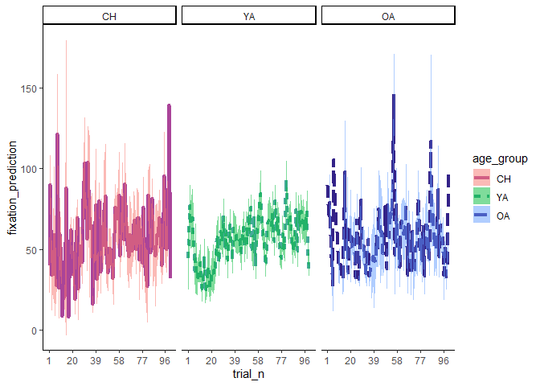
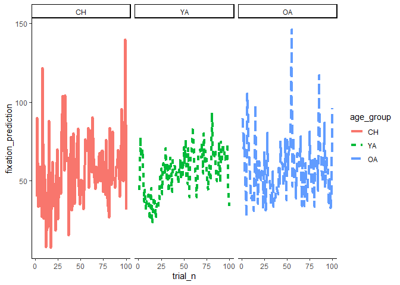
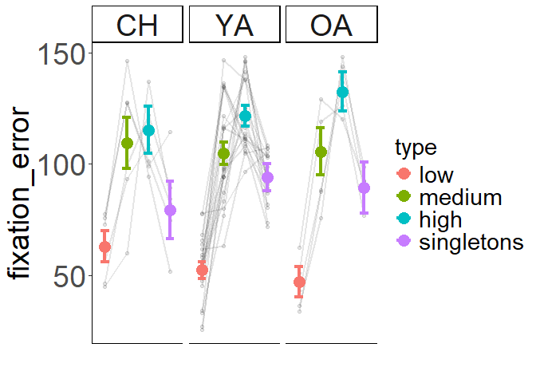
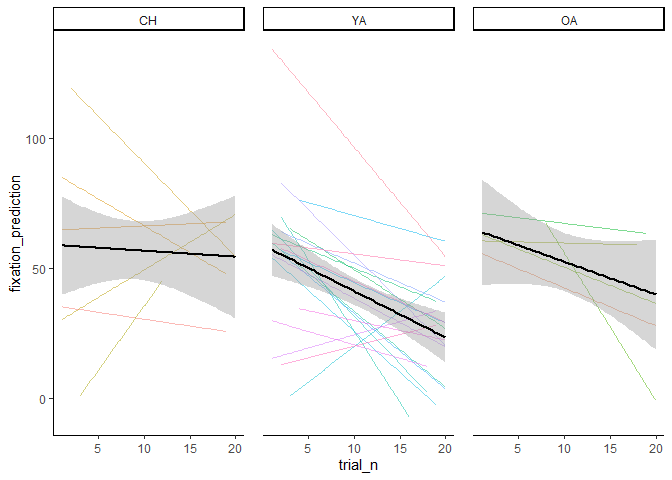

-   [R functions](#r-functions)
    -   [Exclude rows based on a set of criteria (or
        participants)](#exclude-rows-based-on-a-set-of-criteria-or-participants)
    -   [Count the arguments of a
        function](#count-the-arguments-of-a-function)
    -   [Call a function by a character
        string](#call-a-function-by-a-character-string)
    -   [Go through a list of items and select the ones that meet some
        criteria (contains rm in a
        loop)](#go-through-a-list-of-items-and-select-the-ones-that-meet-some-criteria-contains-rm-in-a-loop)
    -   [select items in a dataset that start or end with a
        string](#select-items-in-a-dataset-that-start-or-end-with-a-string)
    -   [substring before/after a specific
        character](#substring-beforeafter-a-specific-character)
    -   [Select elements in a vector that start or end with a
        letter](#select-elements-in-a-vector-that-start-or-end-with-a-letter)
    -   [Reshape a dataset](#reshape-a-dataset)
    -   [Looping](#looping)
        -   [Append dataframes in a loop](#append-dataframes-in-a-loop)
        -   [Error Handling](#error-handling)
        -   [Dplyr](#dplyr)
            -   [Count number of observations by
                group](#count-number-of-observations-by-group)
            -   [Count number of missing cases by
                group](#count-number-of-missing-cases-by-group)
            -   [Calculate means with grouping factor with
                dplyr](#calculate-means-with-grouping-factor-with-dplyr)
            -   [Add trial number in a long dataset with
                dplyr](#add-trial-number-in-a-long-dataset-with-dplyr)
        -   [ggplot](#ggplot)
            -   [Plot a summary line across the
                trials](#plot-a-summary-line-across-the-trials)
            -   [Set default options for multiple
                plots](#set-default-options-for-multiple-plots)
            -   [Plot within-particiants error bars plus individual
                lines by
                condition](#plot-within-particiants-error-bars-plus-individual-lines-by-condition)
            -   [Rain-clouds plots](#rain-clouds-plots)
        -   [Add a line that connects the means in rain-clouds
            plots](#add-a-line-that-connects-the-means-in-rain-clouds-plots)
            -   [Spaghetti plot](#spaghetti-plot)
            -   [Spaghetti plot with
                quadratic](#spaghetti-plot-with-quadratic)
            -   [Density plots](#density-plots)
        -   [Combine two plots in one (note that the size of the
            components need to be adjusted prior to
            arranging)](#combine-two-plots-in-one-note-that-the-size-of-the-components-need-to-be-adjusted-prior-to-arranging)
        -   [System Administration Tasks](#system-administration-tasks)
            -   [Creating, deleting, copying files and
                directories](#creating-deleting-copying-files-and-directories)
            -   [Get the script’s directory
                path](#get-the-scripts-directory-path)
            -   [Select files according to characters that come before a
                symbol](#select-files-according-to-characters-that-come-before-a-symbol)
            -   [Select files that meet a
                criterion](#select-files-that-meet-a-criterion)
        -   [Stats](#stats)
            -   [Sumamry SE within with non-normative
                means](#sumamry-se-within-with-non-normative-means)
            -   [bootstrapping regression](#bootstrapping-regression)

# R functions

This is a collection of functions typically used in R, especially in
psychology.

For any question, feel free to drop me an email :
<pupillo@psych.uni-frankfurt.de>

### Exclude rows based on a set of criteria (or participants)

Useful code to exclude rows in a dataset that corresponds to
participants we decided to exclude.

``` r
# create fake dataframe with participants and performance columns
df<-data.frame(participants=seq(1:10), performance= sample(seq(0, 1, length.out = 100), 10, T))

df
```

    ##    participants performance
    ## 1             1   0.7373737
    ## 2             2   0.3838384
    ## 3             3   0.9696970
    ## 4             4   0.3838384
    ## 5             5   0.4444444
    ## 6             6   0.2929293
    ## 7             7   0.4747475
    ## 8             8   0.1616162
    ## 9             9   0.2424242
    ## 10           10   0.8282828

``` r
# Participants that we want to exclude
partExcl<-c(1,3,5)

# code to exclude participants
df<-df[!df$participants %in% partExcl, ]

df
```

    ##    participants performance
    ## 2             2   0.3838384
    ## 4             4   0.3838384
    ## 6             6   0.2929293
    ## 7             7   0.4747475
    ## 8             8   0.1616162
    ## 9             9   0.2424242
    ## 10           10   0.8282828

``` r
# we could also use dplyr
library(dplyr)
```

    ## 
    ## Attaching package: 'dplyr'

    ## The following objects are masked from 'package:stats':
    ## 
    ##     filter, lag

    ## The following objects are masked from 'package:base':
    ## 
    ##     intersect, setdiff, setequal, union

``` r
df<- df %>%
  filter(!participants %in% partExcl)
```

### Count the arguments of a function

Function that returns the number of arguments in a function

``` r
# let's create a function that calculate the means between three dimenions (x, y ,z)

foo<-function(x, y, z){
  sum (x, y, z)/ length(c(x, y,z))
}

# now I want to assign the number of the arguments of this function to a vector. 
# I can use "formals" to store the argumens

fooArgs<-formals(foo)

fooArgs
```

    ## $x
    ## 
    ## 
    ## $y
    ## 
    ## 
    ## $z

``` r
# then I can extract the number of the arguments with "length"
numfooArgs<-length(fooArgs)

numfooArgs
```

    ## [1] 3

### Call a function by a character string

How to assign a name of a function to a character string and then call
it later? By using “get”.

``` r
# Create a function. This one calculate the average of three dimensions

foo<-function(x, y, z){
  sum (x, y, z)/ length(c(x, y,z))
}

# Now create a carachter string with the name of the formula

foostr<-"foo"

foostr
```

    ## [1] "foo"

``` r
# use "get" to call the function

myfunction<-get(foostr)

# now we can call our function
myfunction(3,4,5)
```

    ## [1] 4

``` r
numfooArgs
```

    ## [1] 3

### Go through a list of items and select the ones that meet some criteria (contains rm in a loop)

This example is based on the BOSS dataset

``` r
# we need the readxl package to read the excel file with the object info
library(readxl)
# and dplyr for intabulating
library(dplyr)

# retrieve the file with info of the categories
category<-read_excel("SI1.xlsx", sheet = "Sheet2")

# change fourth and fifth names to include an underscore
names(category)[4:5]<-c("modal_categ", "cat_agreement")

# get the number of objects per category
table<-category %>% 
  group_by(modal_categ) %>% 
  tally()

# order by modal categ and name agreement
table<-table[order(table$n, decreasing=T),]

# show the first 11
head(table, n=11)
```

    ## # A tibble: 11 × 2
    ##    modal_categ                       n
    ##    <chr>                         <int>
    ##  1 Food                            168
    ##  2 Kitchen & utensil               117
    ##  3 Building infrastructure          96
    ##  4 Hand labour tool & accessory     95
    ##  5 Outdoor activity & sport item    94
    ##  6 Electronic device & accessory    91
    ##  7 Decoration & gift accessory      80
    ##  8 Gamestoy & entertainment         67
    ##  9 Clothing                         64
    ## 10 Vehicle                          64
    ## 11 Stationary & school supply       60

``` r
# select the categories
selCat<-c( "Outdoor activity & sport item", "Kitchen & utensil","Electronic device & accessory", "Hand labour tool & accessory")

# create a dataset with only the categories
dataSel<-category[category$modal_categ %in% selCat, ]

# select the the first 40 images with the highest category agreement level for each category, 
# assign them to the relative dataset
for (cat in 1:length(selCat)){
  # subset the database
  dataim<- dataSel[dataSel$modal_categ==selCat[cat],]
  # order it
  dataim<-dataim[order(dataim$cat_agreement, decreasing = T),]
  # select first 40 
  datapractsel<-dataim[1:40,]
  # assign to a dataset
  assign(paste(selCat[cat],"_dat",sep=""), datapractsel)
  
}

# merget the datasets 
tomerge<-ls(pattern = "*_dat$")
dataim_all<-as.data.frame(NULL)

for (n in tomerge){
  dataim_all<-rbind(dataim_all, get(n) )
}

# delete the previously created single datasets
for (i in 1:length(tomerge)){
  name<-tomerge[i]
  rm(list=tomerge[i])
}
```

### select items in a dataset that start or end with a string

``` r
# select variables that start with lh or rh
datasub<-data[, c( grep( "^lh_", names(data), value = TRUE), 
                   grep( "^rh_", names(data), value = TRUE))]

# select items that ends with "thickness"
datasub<-data[, c(grep("_thickness$", names(data), value = TRUE))]
```

### substring before/after a specific character

``` r
# substring the ID depending on what comes before "_" or before ".EDF" 
sub("\\_.*|\\.EDF", "", files)

# substring depending on whta comes after 'sub-'
sub("sub-\\.*","", sub)
```

### Select elements in a vector that start or end with a letter

``` r
# create a vector
vect<-c("One", "Two", "Three", "Four", "Five")

# select only the elements that start with the letter "T"
Tvect<-vect[grep("T", vect)]

Tvect
```

    ## [1] "Two"   "Three"

``` r
# select only the elements that end with the letter "e"
Evect<-vect[grep("e$", vect)]

Evect
```

    ## [1] "One"   "Three" "Five"

### Reshape a dataset

``` r
# Load the reshape2 package
library(reshape2)

# create a long dataset 
# Example long dataset with 3 rows per participant and multiple variables
long_data <- data.frame(
  participant = rep(1:10, each = 3), # Example participant IDs
  time = rep(1:3, times = 10),        # Example time points
  measurement1 = rnorm(30),           # Example measurements
  measurement2 = rnorm(30),           # Another example measurement
  measurement3 = rnorm(30)            # Yet another example measurement
)

# Melt the long dataset to convert it into a long format
melted_data <- melt(long_data, id.vars = c("participant", "time"))

# Cast the melted data to wide format
wide_data <- dcast(melted_data, participant ~ time + variable)

# Print the wide dataset
print(wide_data)
```

    ##    participant 1_measurement1 1_measurement2 1_measurement3 2_measurement1
    ## 1            1     -1.3646162      1.3357079     -1.1264654     0.40590780
    ## 2            2     -0.5227282     -1.2726066      1.1841556    -1.56900469
    ## 3            3     -0.8137276      0.4273476     -0.3303401    -0.01928193
    ## 4            4      2.0049606     -0.3902477     -0.8201857    -0.55360007
    ## 5            5      0.7848779     -0.2956481      1.8532297     0.46621599
    ## 6            6     -0.3981526     -0.1683850     -0.7354067    -0.52380332
    ## 7            7      0.6168212      0.5225789      1.1883458     1.09158708
    ## 8            8     -1.1025959      0.6629259     -0.4258561     1.32185738
    ## 9            9      0.9560861      0.1859792     -1.0107966     1.45223461
    ## 10          10      0.8161719      1.2371424     -1.8866513    -1.15969554
    ##    2_measurement2 2_measurement3 3_measurement1 3_measurement2 3_measurement3
    ## 1      -1.4431244     1.16272469     2.32752120     1.72611433    -0.09602687
    ## 2      -0.9902413    -1.85475814     0.01768033     1.50878921     0.29782419
    ## 3      -1.3128529     0.08710345    -0.31128807    -0.74920102    -0.34943942
    ## 4       1.2232879    -0.81050285     0.17941727    -0.06273997    -0.41756646
    ## 5      -0.1797314    -1.03412790     0.25001613    -0.43837575     0.55327006
    ## 6      -0.8863547    -0.14767523    -1.13776194     1.87547235     0.12379534
    ## 7      -0.8724806     0.50671794    -0.41941722     1.06498970     0.28239274
    ## 8       0.7865213     0.18039751    -1.10264395     2.42614014    -0.76975452
    ## 9       0.9615018     1.06718996    -0.82164717    -0.17879297     0.57100000
    ## 10      0.8244921    -2.27437893     1.58937633    -0.65761457    -1.87574338

## Looping

Functions that are used for looping through data \#### create a progress
bar

``` r
# using the previous example of the boss dataset

# make a progress bar
pb<-txtProgressBar(min=0, max=length(selCat), style =3)
```

    ##   |                                                                              |                                                                      |   0%

``` r
for (cat in 1:length(selCat)){
  # subset the database
  dataim<- dataSel[dataSel$modal_categ==selCat[cat],]
  # order it
  dataim<-dataim[order(dataim$cat_agreement, decreasing = T),]
  # select first 40 
  datapractsel<-dataim[1:40,]
  # assign to a dataset
  assign(paste(selCat[cat],"_dat",sep=""), datapractsel)
  
  #progress bar
  setTxtProgressBar(pb, i) 
}
```

    ##   |                                                                              |======================================================================| 100%

#### Append dataframes in a loop

``` r
# first, create a list
my_list<-list()


# loop through the dataframes
for (dataframe in 1:length(dataframes)){
  
  currdataframe<-dataframes[datamframe]
  # assign a dataframe to the list
  my_list[[dataframe]]<-currdataframe
  
  
}

# merge the files outside the loop
all_df<-do.call(rbind, my_list)
```

#### Error Handling

Don’t stop the loop when there is an error, but catch the error

``` r
# create a variable with random numbers, but with a NA
randVar<-c(1,2,3,4,NA, 6,7)

# loop through it, checking whether it is bigger than 5
for (num in randVar){
  if (num>5){
    print(paste(num, "is bigger than five"))
  } else {
    print(paste(num, "is smaller than five"))
  }
}

# create a variable to store missing cases
missing_cases<-vector()

# and a counter to store them
miss_count<-1
# as you can see, it stops when there is a NA
# let's use 'tryCatch'
for (num in randVar){
  tryCatch({
    
    if (num>5){
      print(paste(num, "is bigger than five"))
    } else {
      print(paste(num, "is smaller than five"))
    }
  },
  
  # we want to cathc the error and print something informative,
  # like at which number it crashed
  error= function(e) {print(paste("problem with number", num))
    
    print(paste(num, "is not a number"))
    
    # we could also do something for this case
    # we could assign to a list of missing cases, so we can count them
    missing_cases[miss_count]<<-num
    # we need the superassignment operator "<<-" to assign this to the 
    # global environment
    
    # update the counter
    miss_count<<-miss_count+1
  }
  )
}

# how many missing cases?
length(missing_cases)
```

### Dplyr

#### Count number of observations by group

``` r
category %>%
  group_by(modal_categ) %>%
  tally()
```

    ## # A tibble: 30 × 2
    ##    modal_categ                       n
    ##    <chr>                         <int>
    ##  1 Bird                             32
    ##  2 Bodypart                         18
    ##  3 Building infrastructure          96
    ##  4 Building material                27
    ##  5 Canine                            8
    ##  6 Clothing                         64
    ##  7 Crustacean                        8
    ##  8 Decoration & gift accessory      80
    ##  9 Electronic device & accessory    91
    ## 10 Feline                           10
    ## # ℹ 20 more rows

#### Count number of missing cases by group

``` r
category %>%
  group_by(modal_categ) %>%
  dplyr::summarise(CountCase = n(), PercNA = sum(is.na(modal_categ))/n()*100)
```

    ## # A tibble: 30 × 3
    ##    modal_categ                   CountCase PercNA
    ##    <chr>                             <int>  <dbl>
    ##  1 Bird                                 32      0
    ##  2 Bodypart                             18      0
    ##  3 Building infrastructure              96      0
    ##  4 Building material                    27      0
    ##  5 Canine                                8      0
    ##  6 Clothing                             64      0
    ##  7 Crustacean                            8      0
    ##  8 Decoration & gift accessory          80      0
    ##  9 Electronic device & accessory        91      0
    ## 10 Feline                               10      0
    ## # ℹ 20 more rows

#### Calculate means with grouping factor with dplyr

``` r
library(dplyr)
meanGroup<- category %>%
  group_by(modal_categ) %>%
  slice( (1:10)) %>% # take only the first 10
  summarise(meanCateg = mean(cat_agreement),
            Dataset = unique(Dataset)) # keep the other variable
```

    ## Warning: Returning more (or less) than 1 row per `summarise()` group was deprecated in
    ## dplyr 1.1.0.
    ## ℹ Please use `reframe()` instead.
    ## ℹ When switching from `summarise()` to `reframe()`, remember that `reframe()`
    ##   always returns an ungrouped data frame and adjust accordingly.
    ## Call `lifecycle::last_lifecycle_warnings()` to see where this warning was
    ## generated.

    ## `summarise()` has grouped output by 'modal_categ'. You can override using the
    ## `.groups` argument.

``` r
meanGroup
```

    ## # A tibble: 48 × 3
    ## # Groups:   modal_categ [30]
    ##    modal_categ             meanCateg Dataset        
    ##    <chr>                       <dbl> <chr>          
    ##  1 Bird                        0.979 BOSS-2014 (v.2)
    ##  2 Bodypart                    0.795 BOSS-2014 (v.2)
    ##  3 Building infrastructure     0.669 BOSS-2014 (v.2)
    ##  4 Building material           0.596 BOSS-2014 (v.2)
    ##  5 Building material           0.596 BOSS-2010 (v.1)
    ##  6 Canine                      0.806 BOSS-2014 (v.2)
    ##  7 Clothing                    0.848 BOSS-2014 (v.2)
    ##  8 Clothing                    0.848 BOSS-2010 (v.1)
    ##  9 Crustacean                  0.668 BOSS-2014 (v.2)
    ## 10 Crustacean                  0.668 BOSS-2010 (v.1)
    ## # ℹ 38 more rows

#### Add trial number in a long dataset with dplyr

``` r
# create data frame 
trial_df <- data.frame('subject' = c(rep('101', 3), rep('102', 3)),
                       'result' = c(32, 33, 64, 12, 18, 14))

# group by subject and add a row number
# assumes your data frame is ordered by trial number for each subject
trial_df <- trial_df %>%
  group_by(subject) %>%
  mutate(trial_number = row_number())
```

### ggplot

#### Plot a summary line across the trials

``` r
# load the ggplot library
library(ggplot2)

# import the toy dataset
data_long<-read.csv("All_data.csv")

sum_et<-data_long %>%
  group_by(participant) %>%
  summarise(et = mean(fixation_error, na.rm = T))

# which participants have the et data?
part_incl<-sum_et$participant[!is.na(sum_et$et)]
# select only those
all_data_et<-data_long[data_long$participant %in% part_incl,]

# reorder the levels
all_data_et$age_group<-factor(all_data_et$age_group, levels = c("CH", "YA", "OA"))
all_data_et$type<-factor(all_data_et$type, c("low", "medium", "high", "singletons"))

# look at the data
head(all_data_et[c("participant", "fixation_prediction", "age_group", "trial_n")])
```

    ##     participant fixation_prediction age_group trial_n
    ## 701          59            48.25613        CH      53
    ## 702          59            48.85646        CH       2
    ## 703          59                  NA        CH      37
    ## 704          59                  NA        CH      93
    ## 705          59            19.06101        CH      12
    ## 706          59            30.02295        CH      56

``` r
# now we want to plot a line which summarises the fixation-deviation across the trials, with some errors

# we need to summarise the percentage within participants
library("Rmisc") # load the library
```

    ## Loading required package: lattice

    ## Loading required package: plyr

    ## ------------------------------------------------------------------------------

    ## You have loaded plyr after dplyr - this is likely to cause problems.
    ## If you need functions from both plyr and dplyr, please load plyr first, then dplyr:
    ## library(plyr); library(dplyr)

    ## ------------------------------------------------------------------------------

    ## 
    ## Attaching package: 'plyr'

    ## The following objects are masked from 'package:dplyr':
    ## 
    ##     arrange, count, desc, failwith, id, mutate, rename, summarise,
    ##     summarize

``` r
# sumamrise
dat_summary_fix_pr<- summarySEwithin(all_data_et,
                                     measurevar = "fixation_prediction",
                                     withinvars = "trial_n" , 
                                     betweenvars = "age_group",
                                     idvar = "participant", 
                                     na.rm = T)
```

    ## Automatically converting the following non-factors to factors: trial_n

``` r
# conver the trial number as numeric
dat_summary_fix_pr$trial_n<-as.numeric(dat_summary_fix_pr$trial_n)
# load the library
library(ggplot2)

# plot
ggplot(dat_summary_fix_pr,aes(x = trial_n, y = fixation_prediction, 
                              # this assigns the color to the group
                              color = age_group, fill = age_group, 
                              # this changes the line type as a funciton of group
                              linetype = age_group, group = 1))+
  # this adds the line
  stat_summary(fun.y="mean",geom="line", size = 1.5)+
  # this add the shadow considering the within-participant standard error
  geom_ribbon(aes(ymin=fixation_prediction-se, ymax=fixation_prediction+se), alpha=0.5, colour=NA)+
  # divide the plot as a funtion of age group
  facet_wrap(.~age_group)+
  # customise the breaks
  scale_x_continuous(breaks=seq(1, 100, 19))+
  
  # add personalized colours
   scale_color_manual(values = c(c( "#AA4499" ,"#44AA99","#332288")))+

   # add personalized parmaeters
    theme(
    plot.title = element_text(size = 30),
    axis.title.x = element_text(size = 28),
    axis.title.y = element_text(size = 28),
    axis.text=element_text(size=28),
    legend.text=element_text(size=rel(2)),
    legend.title = element_text(size=rel(2)), 
    strip.text.x = element_text(size=28)
  )+
  theme(plot.title = element_text(hjust = 0.5))+
  # use the classic theme
  theme_classic()
```



``` r
    # add annotation
```

#### Set default options for multiple plots

``` r
# We need to set a function
custom_param<-function(){

       # add personalized parmaeters
    theme(
    plot.title = element_text(size = 30),
    axis.title.x = element_text(size = 28),
    axis.title.y = element_text(size = 28),
    axis.text=element_text(size=28),
    legend.text=element_text(size=rel(2)),
    legend.title = element_text(size=rel(2)), 
    strip.text.x = element_text(size=28)
   )+
  theme(plot.title = element_text(hjust = 0.5))
}

# now plot with those parameters
ggplot(dat_summary_fix_pr,aes(x = trial_n, y = fixation_prediction, 
                              # this assigns the color to the group
                              color = age_group, fill = age_group, 
                              # this changes the line type as a funciton of group
                              linetype = age_group, group = 1))+
  # this adds the line
  stat_summary(fun.y="mean",geom="line", size = 1.5)+
  custom_param()+
  facet_wrap(.~age_group)+
  theme_classic()
```



#### Plot within-particiants error bars plus individual lines by condition

``` r
# first, summarise with within-participant error bars
dat_summary_fix_error<- summarySEwithin(all_data_et,
                                       measurevar = "fixation_error",
                                       withinvars = c("type" ), 
                                       betweenvars = "age_group",
                                       idvar = "participant", 
                                       na.rm = T)

# plot it
# first, aggregate the data by participant, age group, and condition (type)
ggplot(all_data_et %>%
         group_by(participant,age_group, type)%>%
         dplyr::summarise(fixation_error=mean(fixation_error, na.rm=T)), 
       aes(x = type, y = fixation_error, colour = type ))+
  # Add some points, which correspond to the participants
  geom_point(alpha = 0.10, colour = "black" )+
  # add a line that connect those points by participant
  geom_line( aes(type, fixation_error,group = participant),
             size=1, alpha=0.1, stat="summary" , colour = 'black')+
  # add a summary line (mean)
  geom_point(stat="summary", size = 5, data = dat_summary_fix_error)+
  xlab("")+
  # add the within-participant confidence intervals
  geom_errorbar(aes( y = fixation_error, ymin = fixation_error - ci, 
                     ymax = fixation_error + ci),
                width = 0.40,size = 1.5, data=dat_summary_fix_error)+
  # divide the plot as a function of age group
  facet_wrap(.~age_group)+
  theme_classic()+
  custom_param()+
  # delete the x axis text and ticks, as we have the legend
  theme(axis.text.x = element_blank(), 
        axis.ticks.x = element_blank()) 
```

    ## `summarise()` has grouped output by 'participant', 'age_group'. You can
    ## override using the `.groups` argument.
    ## No summary function supplied, defaulting to `mean_se()`
    ## No summary function supplied, defaulting to `mean_se()`
    ## No summary function supplied, defaulting to `mean_se()`
    ## No summary function supplied, defaulting to `mean_se()`
    ## No summary function supplied, defaulting to `mean_se()`
    ## No summary function supplied, defaulting to `mean_se()`



#### Rain-clouds plots

``` r
# First, we have to install the packages
source("RainCloudPlots-master/tutorial_R/R_rainclouds.R")
source("RainCloudPlots-master/tutorial_R/summarySE.R")
library(cowplot)

rain_clouds<-ggplot(all_data_et %>%
         group_by(participant,age_group, type)%>%
         dplyr::summarise(fixation_error=mean(fixation_error, na.rm=T)), 
       aes(x = type, y = fixation_error, colour = type ))+
  
    geom_flat_violin(aes(colour = type, fill = type),position = position_nudge(x = .1, y = 0),
                   adjust = 1.5, trim = FALSE, alpha = .5,show.legend = T)+
  
geom_boxplot(position = position_nudge(x = 0.1, y = 0),
               outlier.shape = NA,
               alpha = .5, width = .1,  colour = "black", show.legend = T)+
  #geom_point(stat="summary", size = 5, data = dat_summary_hit_rate)+
  geom_point( aes(type, fixation_error),
              size=2, alpha=0.5, stat="identity",
              position = position_jitter(width = .01),
  )+
  xlab("")+
  #geom_point(stat="summary")+
  #geom_errorbar(aes( y = recog_acc, ymin = recog_acc - ci,
  #     ymax = recog_acc + ci),
  # width = 0.20,data=dat_summary_hit_rate)+
  theme_classic()+
  custom_param()+
  theme(axis.text.x = element_blank(),
        axis.ticks.x = element_blank())+
  ylab("fixation error")
```

    ## `summarise()` has grouped output by 'participant', 'age_group'. You can
    ## override using the `.groups` argument.

``` r
rain_clouds
```

    ## Warning: Using the `size` aesthetic with geom_polygon was deprecated in ggplot2 3.4.0.
    ## ℹ Please use the `linewidth` aesthetic instead.
    ## This warning is displayed once every 8 hours.
    ## Call `lifecycle::last_lifecycle_warnings()` to see where this warning was
    ## generated.


### Add a line that connects the means in rain-clouds plots

``` r
rain_clouds_line<-rain_clouds+
    stat_summary(fun = median, geom = "path", # you could also add "summary", or "identity"
               mapping = aes(group = -1), colour = "black", linetype = 3)

rain_clouds_line
```


#### Spaghetti plot

``` r
# Create a spaghetti plot of some subset trials
  ggplot(all_data_et[all_data_et$trial_n<21,], 
         aes( x=trial_n, y=fixation_prediction))+
  # add the "smooth" line, which the regression method ('l,')
  # and trasparent (0.5)
    geom_line(stat="smooth",method = "lm", formula=y~x, alpha=0.5, se=F)+

  # specify that we want different colours for different participants
    aes(colour = factor(participant))+
  # add the summary line with geom_smooth
    geom_smooth(method="lm",formula=y~x, se=T, colour = "black" )+
    theme(strip.text.x = element_text(size = 13))+
    theme_classic()+
    theme(panel.spacing = unit(1, "lines"))+
    facet_wrap(.~age_group)+
    #ggtitle("Experiment 2")+
    theme(legend.position = "none")
```

    ## Warning: Removed 212 rows containing non-finite outside the scale range
    ## (`stat_smooth()`).
    ## Removed 212 rows containing non-finite outside the scale range
    ## (`stat_smooth()`).



#### Spaghetti plot with quadratic

``` r
all_data_et$PE<-as.numeric(all_data_et$PE)
```

    ## Warning: NAs introduced by coercion

``` r
ggplot(all_data_et, aes( x=PE, y=conf_resp.keys))+
  geom_line(stat="smooth",method = "lm", formula=y~poly(x,2), alpha=0.5, se=F)+
  aes(colour = factor(participant))+
  geom_smooth(method="lm",formula=y~poly(x,2), se=T, colour = "black" )+
  theme(strip.text.x = element_text(size = 13))+
  theme_classic()+
  theme(panel.spacing = unit(1, "lines"))+
  facet_wrap(.~age_group)+
  #ggtitle("Experiment 2")+
  theme(legend.position = "none")
```

    ## Warning: Removed 930 rows containing non-finite outside the scale range
    ## (`stat_smooth()`).

    ## Warning: Removed 930 rows containing non-finite outside the scale range
    ## (`stat_smooth()`).


#### Density plots

``` r
# Density plots
Plot_loc<-ggplot(all_data_et, aes(x= location_error, fill=type))

density_plot<-Plot_loc+
# plot the density in trasparency
  geom_density(alpha = .5)+
  theme_classic()+
  facet_wrap(.~age_group)+
  
  # geom_vline(xintercept = thres)+
  theme(
    plot.title = element_text(size = 22),
    axis.title.x = element_text(size = 20),
    axis.title.y = element_text(size = 20),
    axis.text=element_text(size=20)
  )+
  xlab("location error")+
  #theme(legend.position = "none")+
  theme(plot.title = element_text(hjust = 0.5))

density_plot
```


### Combine two plots in one (note that the size of the components need to be adjusted prior to arranging)

``` r
library(ggpubr)
```

    ## 
    ## Attaching package: 'ggpubr'

    ## The following object is masked from 'package:cowplot':
    ## 
    ##     get_legend

    ## The following object is masked from 'package:plyr':
    ## 
    ##     mutate

``` r
ggarrange(rain_clouds, density_plot, 
          labels = c("A)", "B)"),
          ncol = 1, nrow = 2, 
          font.label = list(size = 15, face = "bold"))
```


### System Administration Tasks

#### Creating, deleting, copying files and directories

``` r
# create a directory
dir.create("new_folder")

# create a file
# file.create("new_text_file.txt")
# file.create("new_word_file.docx")
# file.create("new_csv_file.csv")

# assign a matrix to those files
fileSample<-matrix(data =0, nrow = 2, ncol = 2)
write.table(fileSample,"new_text_file.txt", row.names = F )
write.table(fileSample,"new_text_file.docx", row.names = F )
write.csv(fileSample,"new_csv_file.csv", row.names = F )


# create lots of files
sapply(paste0("new_folder/file", 1:100, ".txt"), file.create)

# copy files
file.copy("source_file.txt", "destination_folder")

# list all CSV files non-recursively
list.files(pattern = ".csv")

# list all CSV files recursively through each sub-folder
list.files(pattern = ".csv", recursive = TRUE)

# read in all the CSV files
all_data_frames <- lapply(list.files(pattern = ".csv"), read.csv)

# stack all data frames together
single_data_frame <- Reduce(rbind, all_data_frames)

# remove files
file.remove("new_text_file.txt")

# check if a file exists
file.exists("new_text_file.txt")

# check if a folder exists
file.exists("new_folder")
```

#### Get the script’s directory path

Get the path to directory that contains the script and set it as the
working directory

``` r
# get the script directory
path<-rstudioapi::getSourceEditorContext()$path

# split the string into the names of the folders
names<-unlist(strsplit(path, split="/"))

# get number of carachters last name (file name)
charfile<-nchar(tail(names,1))

# subtract that to the path
path<-substr(path, 1,nchar(path) - charfile)

# set wd 
setwd(path)
```

#### Select files according to characters that come before a symbol

Return the characters before a specific symbol

``` r
# take the first file from the previous example
setwd("testsel")
files<-list.files( pattern= ".csv$")
name<-files[1]

name
```

    ## [1] "myfile1.csv"

``` r
# Select the characters before the ".pdf"
sel<-sub("\\.pdf.*", "", name)

sel
```

    ## [1] "myfile1.csv"

#### Select files that meet a criterion

Selecting files that meets a criterion, or file estension

``` r
# create a vector with names that vary in different ways
files<-vector()

for (i in 1:10){
  # the first five are .csv, the others are .pdf
  if (i<6){
    files[i]<- paste("myfile", i, ".csv", sep="")
  } else{
    files[i]<- paste("myfile", i, ".pdf", sep="")
  }
}

# plus some random files
files[11:13]<-c("random1.pdf", "test2.csv", "dunno.rnd")

# create the files in a subfolder
# dir.create("testsel")

setwd("testsel")

# create files
for (f in 1:length(files)){
  write(0, file = files[f])
}


# select all the files that are .csv
selCsv<-list.files( pattern= ".csv$")
selCsv
```

    ## [1] "myfile1.csv" "myfile2.csv" "myfile3.csv" "myfile4.csv" "myfile5.csv"
    ## [6] "test2.csv"

``` r
# now, select files that are .csv OR that start with "myfile"
selCsv<-list.files(pattern= c("myfile", ".csv$"))
selCsv
```

    ##  [1] "myfile1.csv"  "myfile10.pdf" "myfile2.csv"  "myfile3.csv"  "myfile4.csv" 
    ##  [6] "myfile5.csv"  "myfile6.pdf"  "myfile7.pdf"  "myfile8.pdf"  "myfile9.pdf"

``` r
# now, select files that are .csv AND that start with "myfile"
selCsv<-list.files(pattern= c("myfile.*.csv$"))
selCsv
```

    ## [1] "myfile1.csv" "myfile2.csv" "myfile3.csv" "myfile4.csv" "myfile5.csv"

### Stats

#### Sumamry SE within with non-normative means

SummarySEwithin from the “Rmisc” package is a very handy function to
compute within-participant errors (ci, sd, and se). H However, the mean
returned by this function is normative. If you use summary SE within
together with ggplot, you might want to use the following version, which
return the non-normative means.

Taken from:

``` r
summarySE2 <- function (data = NULL, measurevar, groupvars = NULL, na.rm = TRUE, conf.interval = 0.95) {
  library(data.table)
  data <- data.table(data)
  
  length2 <- function(x, na.rm = FALSE) {
    if (na.rm) 
      sum(!is.na(x))
    else length(x)
  }
  
  datac <- data[, .(unlist(lapply(.SD, length2, na.rm = na.rm)), 
                    unlist(lapply(.SD, mean, na.rm = na.rm)),
                    unlist(lapply(.SD, sd, na.rm = na.rm))),
                by = groupvars, .SDcols = measurevar]
  names(datac) <- c(groupvars, "N", measurevar, "sd")
  setkeyv(datac, groupvars)
  
  datac[, se := unlist(sd) / sqrt(unlist(N))] #compute standard error
  
  ciMult <- qt(conf.interval / 2 + 0.5, unlist(datac$N) - 1)
  datac[, ci := se * ciMult]
  datac <- data.frame(datac)
  return(datac)
}

normDataWithin2 <- function (data = NULL, idvar, measurevar, betweenvars = NULL, 
                             na.rm = TRUE) {
  library(data.table); library(dplyr)
  data <- data.table(data)
  setkeyv(data, idvar)
  
  data.subjMean <- data[, .(unlist(lapply(.SD, mean, na.rm = na.rm))), by = idvar, .SDcols = measurevar]
  names(data.subjMean) <- c(idvar, 'subjMean')
  data <- merge(data, data.subjMean)
  setkeyv(data, c(idvar, betweenvars))
  
  measureNormedVar <- paste(measurevar, "Normed", sep = "")
  data <- data.frame(data)
  
  data[, measureNormedVar] <- data[, measurevar] - unlist(data[, "subjMean"]) + mean(data[, measurevar], na.rm = na.rm)
  return(data)
}


#normed and un-normed versions
summarySEwithin2 <- function (data = NULL, measurevar, betweenvars = NULL, withinvars = NULL, 
                              idvar = NULL, na.rm = TRUE, conf.interval = 0.95) {
  
  # Ensure that the betweenvars and withinvars are factors
  factorvars <- sapply(data[, c(betweenvars, withinvars), drop = FALSE], 
                       FUN = is.factor)
  if (!all(factorvars)) {
    nonfactorvars <- names(factorvars)[!factorvars]
    message("Automatically converting the following non-factors to factors: ", 
            paste(nonfactorvars, collapse = ", "))
    data[nonfactorvars] <- lapply(data[nonfactorvars], factor)
  }
  
  # Get the means from the un-normed data
  datac <- summarySE2(data, measurevar, groupvars=c(betweenvars, withinvars),
                      na.rm=na.rm, conf.interval=conf.interval)
  
  # Drop all the unused columns (these will be calculated with normed data)
  datac$sd <- NULL
  datac$se <- NULL
  datac$ci <- NULL
  
  # Norm each subject's data
  ndata <- normDataWithin2(data, idvar, measurevar, betweenvars, na.rm)
  
  # This is the name of the new column
  measurevar_n <- paste(measurevar, "Normed", sep="")
  
  # Collapse the normed data - now we can treat between and within vars the same
  ndatac <- summarySE2(ndata, measurevar_n, groupvars=c(betweenvars, withinvars),
                       na.rm=na.rm, conf.interval=conf.interval)
  
  # Apply correction from Morey (2008) to the standard error and confidence interval
  #  Get the product of the number of conditions of within-S variables
  nWithinGroups    <- prod(vapply(ndatac[,withinvars, drop=FALSE], FUN= function(x) length(levels(x)),
                                  FUN.VALUE=numeric(1)))
  correctionFactor <- sqrt( nWithinGroups / (nWithinGroups-1) )
  
  # Apply the correction factor
  ndatac$sd <- unlist(ndatac$sd) * correctionFactor
  ndatac$se <- unlist(ndatac$se) * correctionFactor
  ndatac$ci <- unlist(ndatac$ci) * correctionFactor
  
  # Combine the un-normed means with the normed results
  merged <- merge(datac, ndatac)
  #merged[, 1] <- as.numeric(as.character(merged[, 1]))
  #merged <- merged[order(merged[, 1]), ]
  return(merged)
}
```

#### bootstrapping regression

Bootstrap is a method for running robust regression on data for which we
do not know the sampling distribution. Bootstrapping regression allows
to get around this problem by estimating the properties of the sampling
distribution from the data. The sample data are treated as a population
from which smaller samples (called bootstrap samples) are taken (with
replacement). The parameter of interest (e.g., the slope in a
regression) is then calculated in each bootstrap sample. This process is
repeated n times, one for each bootstrap sample. We can then order the
obtained parameters and and calculate trhe limits whithin which 95% of
the samples fall. These values are the 95% confidence intervals of the
parameters.

``` r
# load the package that runs the bootstrap
library(boot)
```

    ## 
    ## Attaching package: 'boot'

    ## The following object is masked from 'package:lattice':
    ## 
    ##     melanoma

``` r
# We first need to create a custom-made function that draws samples and run the regression
bootfunc<-function(dataset, random, formula){
  d<-dataset[random,]
  reg<-lm(formula, data = d)
  regsum<-summary(reg)
  funcoef<-regsum$coefficients[2]
  booted.paths<-c(funcoef)
  return<-booted.paths
}

# now let's run a regression our dataset
formula<-measurement1~measurement2
reg<-lm(formula, data = long_data)

summary(reg)
```

    ## 
    ## Call:
    ## lm(formula = formula, data = long_data)
    ## 
    ## Residuals:
    ##      Min       1Q   Median       3Q      Max 
    ## -1.76698 -0.84456 -0.09529  0.78575  2.38787 
    ## 
    ## Coefficients:
    ##              Estimate Std. Error t value Pr(>|t|)
    ## (Intercept)    0.1038     0.1987   0.522    0.605
    ## measurement2  -0.0951     0.1888  -0.504    0.618
    ## 
    ## Residual standard error: 1.062 on 28 degrees of freedom
    ## Multiple R-squared:  0.008981,   Adjusted R-squared:  -0.02641 
    ## F-statistic: 0.2537 on 1 and 28 DF,  p-value: 0.6184

``` r
# now run 5000 bootstrap
bootresults <- boot(data = long_data,formula = formula, statistic = bootfunc, R = 5000)
 funcoef <- boot.ci(bootresults, index = 1, conf = .95, type = "bca")
# print the results
funcoef
```

    ## BOOTSTRAP CONFIDENCE INTERVAL CALCULATIONS
    ## Based on 5000 bootstrap replicates
    ## 
    ## CALL : 
    ## boot.ci(boot.out = bootresults, conf = 0.95, type = "bca", index = 1)
    ## 
    ## Intervals : 
    ## Level       BCa          
    ## 95%   (-0.4243,  0.3827 )  
    ## Calculations and Intervals on Original Scale
